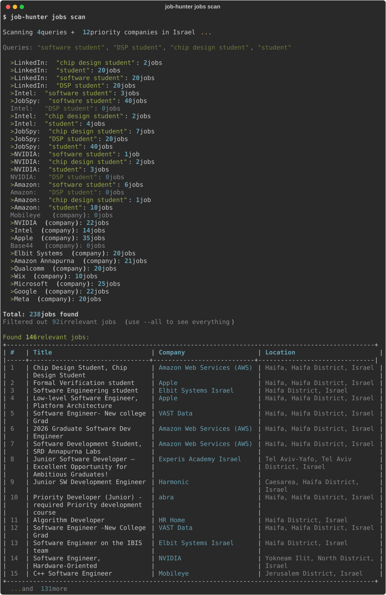
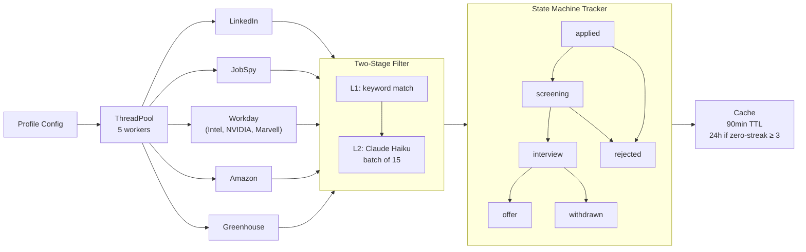

# Job Hunter

[](https://github.com/dvir2705-arch/job-hunter/actions/workflows/tests.yml)


A CLI pipeline that collects job listings from 6 sources concurrently, filters them in two stages, and tracks application state — built around a thread pool, a finite state machine, and an adaptive cache.

<p align="center">
  
</p>

## Why I Built This

I'm a 3rd-year EE student applying to software and embedded roles. The manual process — checking six sites, reading descriptions, deciding relevance, tracking what I applied to — was repetitive and error-prone. I built this to automate the mechanical parts (collection, deduplication, filtering) and keep the decision-making (which jobs to pursue) with me. The interesting engineering problems turned out to be concurrency, caching, and state management.

## Architecture



**Data flow**: Profile config drives query generation. A `ThreadPoolExecutor` (5 workers) dispatches scrapers concurrently, collecting results with `as_completed()` for progressive output. Raw listings pass through a two-layer filter. Surviving jobs enter a state-machine tracker. Per-source results are cached with adaptive TTL. HTTP requests retry with exponential backoff on 429/503.

## Components

### 1. Concurrent Collection (`jobs/scraper.py`)

Scrapes 6 sources in parallel using `ThreadPoolExecutor`. Each scraper is a class with a common interface — LinkedIn and JobSpy use API-like libraries, while Workday/Amazon/Greenhouse scrapers parse HTML. All HTTP requests use exponential backoff with jitter on 429/503 responses.

**Design decision**: Scrapers run concurrently with `as_completed()` rather than `gather()` / batch-then-display. This lets the CLI show results progressively as each source finishes, rather than blocking until the slowest one completes. The tradeoff is slightly more complex output handling, but the UX improvement is significant — the user sees results within seconds even if one source is slow.

### 2. Two-Stage Relevance Filter (`jobs/relevance_filter.py`)

**Layer 1 (local)**: O(n*k) keyword matching against job titles and descriptions. Uses word-boundary regex for short terms to avoid false positives (e.g., "AI" shouldn't match "MAID"). Rejects obviously irrelevant roles (facilities, operations) and seniority mismatches.

**Layer 2 (API)**: Jobs that pass L1 but score uncertain go to Claude Haiku in batches of 15 for semantic classification. This keeps API costs low — only borderline cases hit the model.

**Design decision**: On Haiku API failure, uncertain jobs are accepted rather than rejected. The reasoning is that a false positive (user sees an irrelevant job) is cheaper than a false negative (user misses a relevant one). The user reviews the final list anyway.

### 3. Application State Machine (`applications/models.py`)

Applications move through 6 states: `applied -> screening -> interview -> offer`, with `rejected` and `withdrawn` as terminal states reachable from most nodes. Transitions are enforced by an adjacency-list graph (`VALID_TRANSITIONS` dict) — calling `update_status("interview")` on a `rejected` application raises an error.

**Design decision**: The state machine is strict rather than permissive. Invalid transitions raise exceptions instead of silently succeeding. This caught two bugs during development where the CLI was attempting impossible state changes. The tradeoff is that the CLI needs to handle transition errors, but the data integrity guarantee is worth it.

### 4. Adaptive Cache (`jobs/scan_cache.py`)

Per-source key-value store with a 90-minute default TTL. When a source returns 0 results for 3+ consecutive scans (a "zero streak"), the TTL extends to 24 hours — there's no point re-hitting a source that's consistently empty.

**Design decision**: Cache writes use atomic file operations (`tempfile` + `os.replace()`) instead of direct writes. This prevents corruption if the process is interrupted mid-write. The tradeoff is a slightly more complex write path, but it eliminates a class of bugs where a half-written cache file breaks the next scan.

## Tech Stack

| Component | Choice | Why |
|-----------|--------|-----|
| Language | Python 3.11 | Needed fast prototyping + good concurrency primitives (`ThreadPoolExecutor`) |
| AI | Claude API (Anthropic) | Used for semantic job filtering, CV adaptation, and query generation |
| CLI | Click + Rich | Click for command structure; Rich for tables, progress bars, and formatted output |
| PDF | Jinja2 + headless Chrome | Jinja2 for HTML templating; Chrome for accurate CSS rendering (WeasyPrint couldn't handle RTL) |
| Scraping | python-jobspy, requests, BeautifulSoup | jobspy wraps LinkedIn/Indeed; requests+BS4 for company career pages |
| Concurrency | `concurrent.futures` | stdlib, simple, sufficient for I/O-bound scraping workloads |
| Storage | JSON files (per-user directories) | No database needed at this scale; per-user directory trees give data isolation without auth |

## Quickstart

```bash
git clone https://github.com/dvir2705-arch/job-hunter.git
cd job-hunter
pip install -e .
cp .env.example .env
# Add your ANTHROPIC_API_KEY to .env
job-hunter init
job-hunter jobs scan
```

Requires Python 3.11+ and Google Chrome (for PDF generation).

## Testing

```bash
pytest                              # run all 379 tests
pytest tests/test_scan_cache.py     # run one module
pytest -x                           # stop on first failure
pytest --cov=job_hunter             # with coverage report
```

379 tests across 18 files cover all four core subsystems:

| Subsystem | Tests | What's covered |
|-----------|-------|----------------|
| Collection | 41 | Scraper output format, location filtering, parallel dispatch, deduplication, retry backoff |
| Filtering | 35 | Accept/reject by title, seniority matching, batch Haiku calls, API failure fallback |
| State tracking | 19 | Valid/invalid transitions, follow-up detection, JSON recovery from corruption |
| Caching | 34 | TTL expiry, zero-streak escalation, atomic writes, per-source isolation |

Additional tests cover the onboarding wizard (38), multi-profile management (50), search strategy generation (33), and CLI commands (90+).

## Limitations and Next Steps

**Current limitations:**
- Storage is JSON files — works for single-user CLI, but won't scale to multi-user web service without a database
- Scraping depends on page structure — if a company redesigns their career page, the scraper breaks
- Core subsystems (state machine, cache, config) are at 90-100% coverage; overall coverage is 49%, pulled down by CLI glue code and external API integrations that aren't unit-tested

**What I'd build next:**
- Coverage floor enforcement in CI once CLI-level test gaps are filled
- Job analytics: response rate by source, time-to-response trends
- Interview prep module: generate practice questions from job descriptions

## Project Structure

```
job_hunter/
├── cli.py                  # 7 command groups, 49 subcommands
├── config.py               # Environment + path configuration
├── profile.py              # UserProfile dataclass + schema migration
├── profile_manager.py      # Multi-profile switching
├── jobs/
│   ├── scraper.py          # 6 scraper classes + ThreadPoolExecutor orchestrator + retry backoff
│   ├── relevance_filter.py # Two-layer keyword + Haiku filter
│   ├── scan_cache.py       # TTL cache with zero-streak adaptation
│   ├── search_strategy.py  # Profile-driven query generation
│   ├── discovery.py        # Job discovery orchestration
│   └── history.py          # Scan history
├── cv/
│   ├── adapter.py          # Claude-powered CV adaptation
│   ├── renderer.py         # Jinja2 + Chrome PDF rendering
│   └── manager.py          # CV versioning
├── applications/
│   ├── models.py           # FSM with enforced transitions
│   └── tracker.py          # CRUD + analytics
├── cover_letter/
│   └── generator.py        # Claude-powered generation
└── recruiters/
    ├── manager.py          # Contact management
    └── hunter.py           # Hunter.io integration
tests/                      # 379 tests, 18 files
```

## License

MIT — see [LICENSE](LICENSE).
